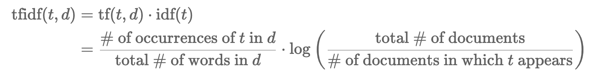
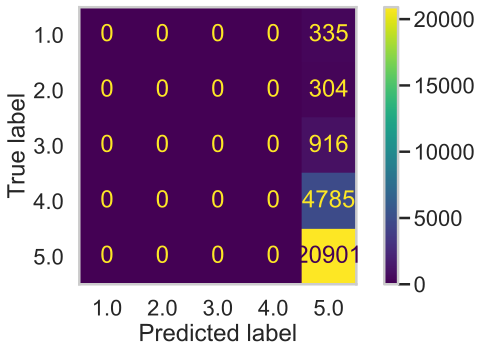
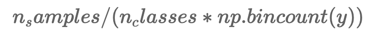
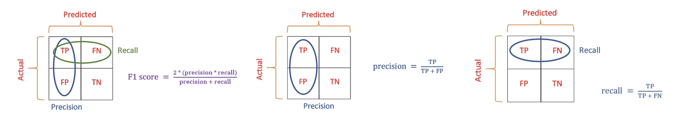
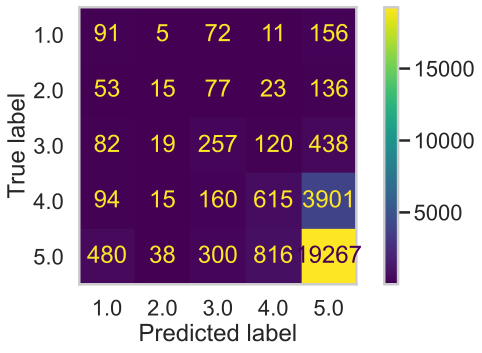
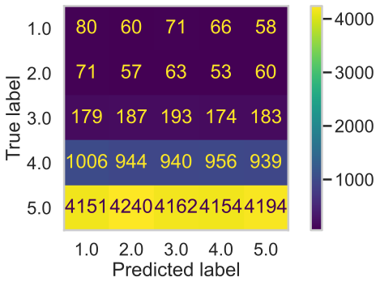
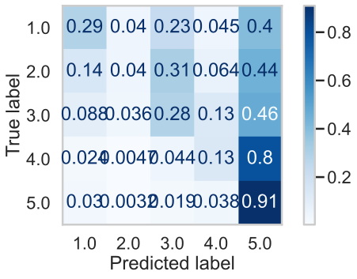
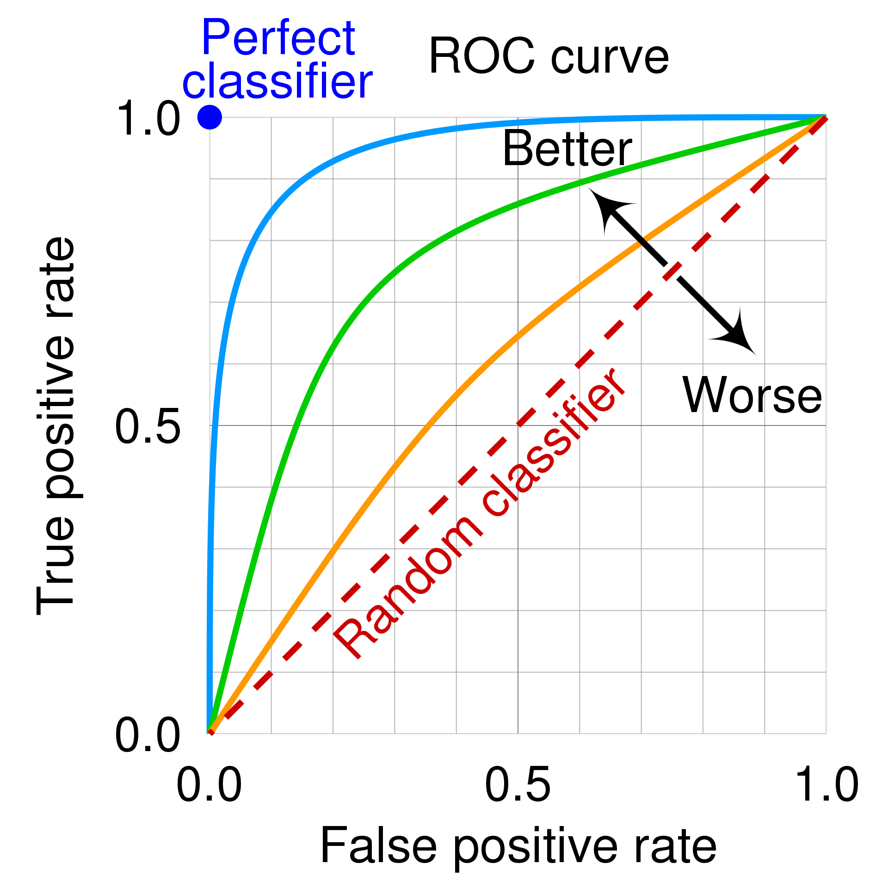
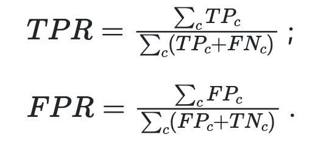
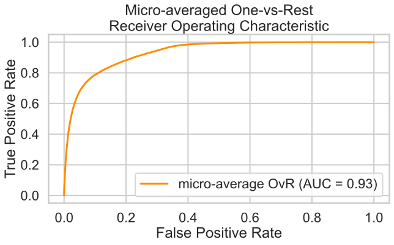

By Kaiwen Bian & Bella Wang

***This website uses plenty of Plotly HTML graph, using a computer browser would deliver the best reading experience. If you are using a mobile device, you might need to move around the plot to view it and the website may take sometimes to load first***

# Content for this Project
1. [Introduction](#introduction)
  - [Random Forest Algorithm](#random-forest-algorithm)
  - [Data Set Description](#data-set-description)
2. [Data Cleaning, Transformation, and EDA](#data-cleaning-transformation-and-eda)
    - [Merging & Transformation](#merging--transformation)
    - [Univariate & Bivariate Analysis](#univariate--bivariate-analysis)
    - [Aggreagted Analysis](#aggreagted-analysis)
    - [Textual Feature Analysis](#textual-feature-analysis)
3. [Assessment of Missingness Mechanism](#assessment-of-missingness-mechanism)
    - [MAR Anlaysis](#mar-anlaysis)
    - [NMAR Analysis](#nmar-analysis)
4. [Permutation Testing of TF-IDF](#permutation-using-tf-idf)
5. [Framing a Predictive Question](#framing-a-predictive-question)
6. [Baseline Model: An Naive Approach](#baseline-model-an-naive-approach)
    - [Preprocess Data Set](#preprocess-data-set)
    - [Handling Missingness in Data](#handling-missing-data)
    - [Train/Val/Test Split](#trainvalidatetest-split)
    - [Feature Engineering](#feature-engineering)
7. [Final Model: Homogenous Ensemble Learning](#final-model-ensemble-learning)
    - [Feature Engineering: Back to EDA)](#feature-engineering-back-to-eda)
    - [Model Pipeline](#model-pipeline)
    - [Hyperparameter Tuning](#hyperparameter-tuning)
    - [Model Evaluation](#model-evaluation)
        - [Feature Importantness](#feature-importantness)
        - [Confusion Matrix & Evaluation Metrics](#confusion-matrix--evaluation-metrics)
        - [Testing Set Evaluation](#tetsing-set-evaluation)
8. [Fairness Analysis](#fairness-analysis)

# Introduction
[Back to Catalog](#content-for-this-project)

This project demonstrate how we may draw insights from a highly unbalanced data set using ensemble learning. Predictive model detecting user preference using **textual features** in combnation with other **numerical features** is the key first step prior to building a reconmander system or doing any other further analysis. The challenge that is addressed in this project is related to the highly imbalance nature of the `recipe` data set that we are using.

We are particularly interesting in predicting user preference (`raing` columns as target) using multiple numerical features and textual feature transformation (tfidf, pca, ...) with a homogenous ensemble learning method (random forest) multi-class classifier.

With the basics from this project moving forward:
1. We can build reconmander systems that can reconmand better recipes to users to better fit their needs and appetite.
2. Understand an potential approach towards solving issues that is relevant with highly imbalanced data, which is quite often in **real word data**.

## Random Forest Algorithm
In this project, we will adapt ideas of **homogenous ensemble learning** where we will use multipl **Decision Trees**, and making them into a **Random Forest** for more  robust predictions of the data.

A **Decision Tree** essentially learns to come up with questions or decisions at an high dimensional space (depending on the number of features) and then separate the data using "boxes" or "lines" in that way. The core mechanism that allows it to happen is using *entropy minimization* where the model tries to reduce the entropy, or uncertainty of each split, making one catagory fit to one side and the other catagory to the other side.

<p align="center"></p>

We are taking the negative of such value because log of an proportion (<1) value outputs a negative value. The minimum value that this formula can output is 0, which corresponds to log(1) or when the whole space is just one catagory!

A **Random Forest** essentially is when at the splitting point of data to train/test/val, **a random subset of features** is taken out instead of choosing from all of them and then spliting the tree base on this subset of the feature, usually speaking m = sqrt(d) seems to work well in practice and it is also the default that `sk_learn` uses. **This allows each decision trees to come up with different prediction rules for later on voting an best one**.
- Notice that we are not doing simple boostrap of the data as each decision tree may not resemble too great of a difference in that way, instead, we are taking different features directly using the same type of model (decision tree), making it a homogenous ensemble learning method.
- We want the individual predictors to have low bias, high variance, and be uncorrelated with each other. In this way, when averaging (taking votes) them together, low bias and low variance would occur.

<p align="center"></p>

## Data Set Description
We can first look at the data frame that we will be working with in this project:

This is the `rcipe` raw data frame:

| Column         | Description                                                                                          |
|----------------|------------------------------------------------------------------------------------------------------|
| 'name'         | Recipe name                                                                                          |
| 'id'           | Recipe ID                                                                                            |
| 'minutes'      | Minutes to prepare recipe                                                                            |
| 'contributor_id' | User ID who submitted this recipe                                                                 |
| 'submitted'    | Date recipe was submitted                                                                           |
| 'tags'         | Food.com tags for recipe                                                                             |
| 'nutrition'    | Nutrition information (calories, total fat, sugar, sodium, protein, saturated fat, carbohydrates)|
| 'n_steps'      | Number of steps in recipe                                                                            |
| 'steps'        | Text for recipe steps, in order                                                                      |
| 'description'  | User-provided description                                                                            |

<br>

This is the `interaction` raw data frame:

| Column      | Description         |
|-------------|---------------------|
| 'user_id'   | User ID             |
| 'recipe_id' | Recipe ID           |
| 'date'      | Date of interaction |
| 'rating'    | Rating given        |
| 'review'    | Review text         |

<br>

These two data frame both contain information that we need, particularly in the `nutrition` column (use for numerical input), and a few of the other catagorical columns such as `tags`, `description`, and `name`. The next section would go more in depth into the transformation on each of the column to prepare for the modeling phase.

*Note: this data frame is quite messy with "hard to work with" types (i.e. date as string) and multiple information compacted in the same column (i.e. nutrition), we will be first doing some data cleaning and conversion of data type using customized function we have created (`initial` and `transform`).*

# Data Cleaning, Transformation, and EDA
[Back to Catalog](#content-for-this-project)

## Merging & Transformation
Initial merging is needed for the two dataset (`interaction` and `recipe`) to form one big data set. We performed a series of merging as follows:

### Merging and `initial()` function
1. First, we left merge the `recipes` and `interactions` datasets together.
2. In the merged dataset, we also filled all ratings of 0 with np.NaN as `rating` of zero doesn't make sense, we will be evaluating this in the missingness mechanism section.
3. We then find the average rating per recipe (as a series) and add this series containing the average rating per recipe back to the recipes dataset.

### Transforming data set using `transform()` function
We also performed a series of follow up transformations to fit our needs for the data set as follows:
1. Some columns, like `nutrition`, contain values that look like lists, but are actually strings that look like lists. We turned the strings into actual columns for every unique value in those lists.
2. Convert to list for `steps`, `ingredients`, and `tags`.
3. Convert `date` and `submitted` to Timestamp object and rename as `review_date` and `recipe_date`.
4. Convert Types.
5. Drop same `id` (same with `recipe_id`).
6. Replace 'nan' string with np.NaN.

After the transformation, we have types of each of the columns as the following:
1. `String`: [name, contributor_id, user_id, recipe_id, ]
    - quantitative or qualitative, but cannot perform mathamatical operations (**quntitative discrete**)
    - `name` is the name of recipe
    - `contributor_id` is the author id of the recipe
    - `recipe_id` is the id of teh recipe
        - `id` from the original dataframe also is the id of the recipe, dropped after merging
    - `user_id` is the id of the reviewer
2. `List`: [tags, steps, description, ingredients, review]
    - qualitative, no mathamatical operation (**qualitative discrete**)
3. `int`: [n_steps, minutes, n_ingredients, rating]
    - quantitative mathamatical operations allowed (**quantitative continuous**)
4. `float`: [avg_rating, calories, total_fat sugar, sodium, protein, sat_fat, carbs]
    - quantitative mathamatical operations allowed (**quantitative continuous**)
5. `Timestamp`: [recipe_date, review_date]
    - quantitative mathamatical operations allowed (**quantitative continuous**)

We can take a look at the cleaned data frame (note this is only a part of the actual data frame, the actual data frame is too big to be displayed on this website, you can check the [developer repository](https://github.com/KevinBian107/ensemble_imbalance_data) or [full report](assets/report.pdf) for more):

| name                                 |   n_steps | tags                                                                                                                                                                                                                        |   calories |
|--------------------------------------|-----------|-----------------------------------------------------------------------------------------------------------------------------------------------------------------------------------------------------------------------------|------------|
| 1 brownies in the world    best ever |        10 | ['60-minutes-or-less', 'time-to-make', 'course', 'main-ingredient', 'preparation', 'for-large-groups', 'desserts', 'lunch', 'snacks', 'cookies-and-brownies', 'chocolate', 'bar-cookies', 'brownies', 'number-of-servings'] |      138.4 |
| 1 in canada chocolate chip cookies   |        12 | ['60-minutes-or-less', 'time-to-make', 'cuisine', 'preparation', 'north-american', 'for-large-groups', 'canadian', 'british-columbian', 'number-of-servings']                                                               |      595.1 |
| 412 broccoli casserole               |         6 | ['60-minutes-or-less', 'time-to-make', 'course', 'main-ingredient', 'preparation', 'side-dishes', 'vegetables', 'easy', 'beginner-cook', 'broccoli']                                                                        |      194.8 |
| 412 broccoli casserole               |         6 | ['60-minutes-or-less', 'time-to-make', 'course', 'main-ingredient', 'preparation', 'side-dishes', 'vegetables', 'easy', 'beginner-cook', 'broccoli']                                                                        |      194.8 |
| 412 broccoli casserole               |         6 | ['60-minutes-or-less', 'time-to-make', 'course', 'main-ingredient', 'preparation', 'side-dishes', 'vegetables', 'easy', 'beginner-cook', 'broccoli']                                                                        |      194.8 |

## Univariate & Bivariate Analysis
We will be performing some **Explorative Data Analysis** on our `recipe` data set, which includes the removal of outlier, understanding data imbalances in target data `rating`, deternmining threshold point in different univariate distribution, and observing some bi/tri variate relationships in some numerical columns.

|       |      sodium |   calories |         minutes |
|-------|-------------|------------|-----------------|
| count | 234429      | 234429     | 234429          |
| mean  |     29.2618 |    419.529 |    106.79       |
| std   |    129.556  |    583.224 |   3285.97       |
| min   |      0      |      0     |      0          |
| 25%   |      5      |    170.7   |     20          |
| 50%   |     15      |    301.1   |     35          |
| 75%   |     33      |    491.1   |     60          |
| max   |  29338      |  45609     |      1.0512e+06 |

Looks like that our data have a lot of outliers! we might want to write a function to deal with that. Here we are writing the function `outlier()`, which will be used quite often later on.

<iframe
  src="assets/eda2.html"
  style="width: 100%; height: 400px; border: none;"
></iframe>

Looks like the data are kind of imbalanced in `rating` (at this point, we thought that this wouldn't effect our modle too much, but it turns out later to be one of the main challenge that we need to deal with during the moeling phase).

<iframe
  src="assets/eda3.html"
  style="width: 100%; height: 400px; border: none;"
></iframe>

Seems like there is a **threshold point** for `n_ingredients` and `n_steps`, this will be utilized later in our **feature engineering** section.

<iframe
  src="assets/eda4_2.html"
  style="width: 100%; height: 400px; border: none;"
></iframe>

It also seems like more `sugar` and more `total_fat` (transformed from `nutrition`) seems to be related to higher `rating`! This is quite suprising and it also seems like that this would be a good feature to include in our model building process. This relationship is more obvious when looking at the left column between `sugar`/`rating` and `calories`/`rating`.

*Note: we originally used a 3D plot that illustrate much more celarly the relationship  between these data, however, 3D plot is not that friendly for mobile platforms and crashes directly when trying to access from a mobile platform, this is why we are using a scatter matrix here.*

<iframe
  src="assets/eda5_2.html"
  style="width: 100%; height: 400px; border: none;"
></iframe>

Seems like there is some sort of relationships between `n_steps`, `n_ingredients`, and the `rating` column. However, this relationship doesn't seem to be that exact. In a later section we might use this idea.

## Aggreagted Analysis
We have implemented a few groupby function previously that groups the data frame by `user_id` and by `recipe_id` then handle each of the column picked accordinly. Now we can first use the groupby functions that we have implemented to look at some aggregated data first before using it for the next few sections.

<iframe
  src="assets/eda6.html"
  style="width: 100%; height: 400px; border: none;"
></iframe>

Looking at the right column of graph, it seems like the previous relationships taht we observed in no aggregation data is still preserved in the aggregated version where higher `calories` seems to be correlated to higher `rating` and `n_ingredients` both seems to have some relationships with `rating` as well.

<iframe
  src="assets/eda7.html"
  style="width: 100%; height: 400px; border: none;"
></iframe>

When aggregating by user, something interesting appears, it seems like that `rating` column is not so much correlated with the `n_ingrredients` column though it is still quite correlated with the `calories` column. **Though we will not be working with this version of the aggregated data frame firectly when we are making our predictive model, this ideas may be taken into considerations when choosing features.**

## Textual Feature Analysis
We actually made more edas and feature engineering with **textual features**, but we will introduce those later in the section as it is much more relevant to our modeling process. For now, we will show some technique with TF-IDF that we will use later on in this project by checking the top 5 **most important** words in each of the rows (recipe_id) in the **original cleaned** data frame filtered by getting only the **5 rating recipes**(note, recipe_id is not unique here).
- We will probably not directly use this approach here as it runs really slow! But we may use a similar approach that have a better runtime complexity!

This would be an example output of such textual feature analysis (randomly sample 10 rows):

|   recipe_id | Top5 Important Words                               |
|-------------|----------------------------------------------------|
|      318280 | else, library, tries, return, names                |
|      420289 | eatingwel, recipe, by, about, com                  |
|      456743 | allrecipes, poultry, condiment, pepper, argentine  |
|      314304 | leaving, demonstration, highschool, messed, speech |
|      503630 | sausage, cajun, thyme, accent, dose                |
|      407747 | splenda, iced, sweetener, stronger, use            |
|      442394 | owned, wall, survive, rationally, family           |
|      284700 | difference, told, lady, elderly, francesca         |
|      358644 | larger, portions, wonder, 21, day                  |
|      407502 | wings, bobby, his, buffalo, cerza                  |

<br>

As illustrated above, this textual feature analysis does capture some noises as some words in this table doesn't seem to be that relevant from a common sense perspective, this is also why in later section when we are working with textual features, instead of using the top 5 words from a recipe, we use the top tfidf word for a recipe
1. Runtime complexity is much better
2. Captures relatively less noises
In practice, our approach seem to work pretty well as illustrated in the [feature importantce section](#feature-importantness)

# Missingness Mechanism
[Back to Catalog](#content-for-this-project)

We are specifically working with the version of the data set that have been grouped by with `recipe_id` to check the missingness, each `recipe_id` in this case would be unique. We can start with checking whcih column is missing. For the easiness of graphing, we will first slice out the outliers in each of the numerical columns using `outlier` function, which slices out ouliers that's out of the 99th percentile of the dataset. First we can check what is actually missing in the data set.

|             | missing |
|-------------|------|
| avg_rating  | 1679 |
| rating      | 1679 |
| description |   48 |

## NMAR Analysis
However, on the other hand, the `rating` column seems to be **Not Missing At Random (NMAR)** becuase from what the website is showing, some people just didn't give rating, so the rating itself doesn't exist during the data collection process, so it makes sense for it to be null. We manually added `np.NaN` into the data set where previously it was filled a zero in the data set. Since `avg_ratng` is calculated from using the `rating` column, `avg_rating` would then be **Missing At Random (MAR)** dependent on `rating`.

One interesting one to analyze is `description`, because it is hard to say directly how it may be correlated to any other columns in this data set, we suspect it to be **MAR**, but we will prove it to be **MAR** in the next section.

## MAR Anlaysis
### Decision Rule for Missing Description
Let's assume that the missingess of `description` column is related to the 2 columns here (`n_ingredients` and `calories`) since these 2 continuous columns seems to be an common factor that might cause the missing of description (too high calories? Or too many ingredients?). However, these are only some hypothesis, we need to actually try to reject or fail to reject them. We assume that the missingness for `description` wouldn't depend on discrete columns.

We can first look at `description` missing dependent on the `calories` column, we will do a first step analysis by just looking at the `kde` graph of the two distribution, one where `description` is missing and one where `description` is not missing. *Note that this doesn't give us enough power to say we reject or fail to reject our hypothesis, rather it is just a first quick check of the distribution.*

<iframe
  src="assets/missing_kde_calories.html"
  style="width: 100%; height: 400px; border: none;"
></iframe>

Then we can check the `n_ingredients` column:
<iframe
  src="assets/missing_kde_n_ingredients.html"
  style="width: 100%; height: 400px; border: none;"
></iframe>

`description` seems to also depend on `n_ingredients`. This is a very interesting graph because looks like the graph **shape** is quite different with the **mean** the same, instead of using permutation test statistics that involves **mean** we use **K-S statistics** insteaad (we have also down a test using differences in mean as well, which fail to identify any results).

### Permutation Testing Using K-S Statistics
Now we want to perform permutation testing with each of the continuous variable within the data set (assuming that the missingness of `description` depends on them) and plot the distribution. Also, we decide to use a testing threshold of p=0.05.

<iframe
  src="assets/missing_permutation_calories.html"
  style="width: 100%; height: 400px; border: none;"
></iframe>

<iframe
  src="assets/missing_permutation_n_ingredients.html"
  style="width: 100%; height: 400px; border: none;"
></iframe>

Seems like `n_ingredients` p value passes the threshold of p=0.05!

From what the plot have suggest, it seems like missingess for `description` is related to `n_ingredients` and it seems like missingness in `description` is not related to `calories`.

# Permutation using TF-IDF
[Back to Catalog](#content-for-this-project)

For this section, we will be working with the same data frame that was used in the missingness mechanism section, so a data frame that is grouped by `recipe_id`.

Since we want to do certain textual feature analysis for our predictive model, we were wondering whether TF-IDF of the `description` columns would actually play a role in deternmining the `rating` of an recipe. This can be deemed as a mini-warmup for our modeling procedure later on.

## Intro to TF-IDF
### Term Frequency Inverse Document Frequency
TF-IDF is a very naive but common and well performing technique that people use to understand textual features. It essentially meausres the **how important** an word $t$ is for an sentence in comparison with all sentences in the document. The TF-IDF Formula is a as follows:

<p align="center"></p>

We will be using the `TfidfVectorizer` package from `sk_learn` to help our calculation.

### Differences in Max for TF-IDF
We want to see whether the distibution of `high_rated` recipes and the distribution of `low_rated` recipes actually come from the same distribution. Thus, we will be performing a **permutation test** here with the following hypothesis:
- **Null hypothesis**: There **are no** differences in the distribution for the `high_rated` recipes and low_rated` recipes.
- **Alternative hypothesis**: There **are** differences in the distribution for the `high_rated` recipes and low_rated` recipes.
- We decide to use a testing threshold of p=0.05

As for the **test statistics**, we actually have many options, but they all circles around the **differences** of something, we will go through each of them and discuss their cons and pros:
- Using `sum` -> longer sentences have greater sum
- Using `mean` -> very easy to be influenced by outlier
- Using `partial-mean` -> get the most essence part of the sentence, however, complexity too high because of the sorting
- Using `max` -> most important one word's TF-IDF

With all these considerations, we pick our test statistics to be **differences in max of TF-IDF for each sentence**. This section provide a **solid prove** of why we are using TF-IDF as a feature for our predictive model!

## Conducting Permutation Testing

<iframe
  src="assets/permutation_test.html"
  style="width: 100%; height: 400px; border: none;"
></iframe>

The result is significant! **We reject the null hypothesis with a p value that is lower than 0.05!** There is a difference in the distribution for `high_rated` recipes and `low_rated` recipes.

# Framing a Predictive Question
[Back to Catalog](#content-for-this-project)

From the previous section we have learned that Recipe's Max TF-IDF distribution is different for `high_rated` recipe than `low_rated` recipe, so now we want to go a step further: we want to predict `rating` as a classfication problem to demonsrate user preference and as a potential prior to reconmander system.

Specifically, **we want to predict `rating` (5 catagories) in the original data frame to demonstarte understanding of user preference.** In this section we will be using the original big DataFrame for predicting `rating`.

# Baseline Model: An Naive Approach
[Back to Catalog](#content-for-this-project)

## Preprocess Data Set
From this point forward, the modeling process would use the data set transformed by the following function where we used `.pipe()` function to conduct all neccessary changed to the base merged data frame in the same way from the previous section, then selcected out only the neccessary column that we would be using for this question.

```python
base_df = (step0
           .pipe(initial)
           .pipe(transform_df)
           .pipe(outlier)
           )[['n_ingredients','minutes','n_steps','description','sugar','calories','sodium','total_fat','rating','tags','name','recipe_date','review']]
```

### Special Considerations:
1. We created two additional features of `is_low` and `is_good`, which will be use for later for creating pool of text. We have conider the problem of ptential **data leakage**. However, this creation is prior to train/val/test split and the test data (not being used for fit) would still have these 2 columns but it would not be used to predict the `rating`. Thus, this wouldn't constitute the issue of data leakage as this pool of text is only created and fitted using training data.
2. We included the `review` column as a feature in our data set, which may be introducing **data not available at the time of modeling** as `reviews` doesn't exactly come before `rating` does. However, the data farme we are using does not have one to one mapping between recipe and user, meaning that there may exist many previous ratings and reviews prior to one user giving rating, this makes the available review at the time of modeling rating to be *n-1*. As an naive approach, we would use `reviews` directly.

## Handling Missing Data
### Missing Rating
It have been shwon earlier that the missingness of the `rating` columns seems to be **NMAR**, so it is not dependent on the column but rather depending on itself. Thus, the naive approach taht we will be imputing the ratings through **random imputation**. However, because of the high imbalance nature of the data set, this may cause more `rating` of 5 to come up.
  - Regarding this issue, we ran the model on both imupting randomly and also on dropping the missing data directly for the `rating` column (second choise make sure that the target column is not randomly imputed, this may cause error)
  - After experimentation, drpping the missing `rating` directly results in both a training/validation and testing accuracy

### Missing Description
For the missingness in `description`, we make sure that the distribution of the data is the same by not dropping it but rather imputing it with simple white space. It is true that the `description` column missgness is MAR, but it would be quite difficult to try to impute it, so we pick an naive solution in this project.

## Train/Validate/Test Split
We are splitting the main data set into 3 components of `train`, `validate`, and `test`. The main data set is plit to `big_train` and `test` first with big_train being 75% of the data. Then, the big_train data set is split again into the `validate` and the actual `train` data set with 75% in the train data set again. Each set is taking the percentatge as calculated below:

|    Splits   | Percentage |
|-------------|------------|
|    Test     |     25%    |
| Train_big   |     75%    |
|  Validate   |    18.75%  |
|   Train     |    56.35%  |

Agian, notice that the column does not sum up to 1, this is because that the validate and train set is a further split of train_big. train + validate + test = full sample.

## Feature Engineering
In the basic model pipeline we are working with not a great number of features. The value of the threshold and normalziation target are results from previous eda section.
1. binarized `n_step` with threshold 25
2. binarized `n_ingredients` with threshold 20
3. normalized `minutes` with respects to binarized `n_steps` using the customized class `StdScalerByGroup`
4. normalized `minutes` with respects to binarized `n_ingredients` using the customized class as above
5. simple counts of `tags` column

## Baseline Model's Pipeline
The pipeline for the model is constituted with a simple **Random Forest** multi-class classfier with **no** hyperparameter tuned, the model pipeline can be nicely summarized by the illustration below:

```python
Pipeline(steps=[('preprocessor',
                 ColumnTransformer(transformers=[('bi_nsteps',
                                                  Binarizer(threshold=25),
                                                  ['n_steps']),
                                                 ('bi_ningredients',
                                                  Binarizer(threshold=20),
                                                  ['n_ingredients']),
                                                 ('norm_minutes_binary_nsteps',
                                                  Pipeline(steps=[('bi_nsteps',
                                                                   Binarizer(threshold=25)),
                                                                  ('norm_minutes_binary_nsteps',
                                                                   FunctionTransformer(func=<function <lambda> at 0x31c3ed5e0>))])...
                                                 ('norm_minutes_binary_ningredients',
                                                  Pipeline(steps=[('bi_nsteps',
                                                                   Binarizer(threshold=25)),
                                                                  ('norm_minutes_binary_nsteps',
                                                                   FunctionTransformer(func=<function <lambda> at 0x31c3ed5e0>))]),
                                                  ['n_ingredients', 'minutes']),
                                                 ('tag_counts',
                                                  FunctionTransformer(func=<function tag_counts at 0x31c3ed4c0>),
                                                  ['tags'])])),
                ('rfc',
                 RandomForestClassifier(criterion='entropy', max_depth=2,
                                        n_estimators=140))])
```

We fit this model to the training data set and then use it for some simple evaluation. This model actually got an accuracy of `0.7672625821372197`, this sounds pretty good! But wait, remanber that accuracy does not entell everything. We can look at the confusion matrix for this base model is illustrated as below:

<p align="center"></p>

Turns out the original dataset target is highly **imbalanced**, making the model always predicting a `rating` of 5 not missing many of the other details. This also means that as long as the model is always predicting the `rating` of 5, it will get an accuracy of 77% because 77% of the `rating` is 5 -> **accuracy doesn't entell everything!**. Thus, we need a better model than this that can capture some what more feature information, more engineering is needed!

# Final Model: Ensemble Learning
[Back to Catalog](#content-for-this-project)

Now with the previous baseline model's problem in mind, let's make some actual useful feature engineering, mainly we will be utilizing these features:

## Feature Engineering: Back to EDA
The previous features are carried over to this model, which includes:
1. binarized `n_step` with threshold 25, this is a result from eda
2. binarized `n_ingredients` with threshold 20, this is a result from eda
3. normalized `minutes` with respects to binarized `n_steps`
4. normalized `minutes` with respects to binarized `n_ingredients`
5. simple counts of `tags` column, showing how many tags are in each `tag` column

In addition, awe also added afew more features to capture the relationship we saw from EDA, whcih includes:

### RobustScaler With Numerical Features
Some numerical columns of `sugar`,`sodium`,`calories`,`total_fat` that have being standerlized using `RobustScaler`

### TFIDF Analysis
Two TF-IDF that have been one hot encoded:
- In particular, the naive approach is to use the highest TF-IDF for each of the words are extracted for each of the sentence using argmax, representing the most important words in a sentence (we are using argmax here is for considering the complexity of this model, later implementations can utilzie more words that have high TF-IDF).
- We then construct a pool of highest TF-IDF words in the **low** `rating` dataset, which was originally defined as `rating` lower than or equal to 3 and it is stored as a boolean indicator in the `is_low` column.
- Finally, we want to see whether or not the current sentence's highest TF-IDF word is in such pool of words.
- We perform such operations with both the `name` column and also the `description` column.
- **Remark**: this feature improved the final model by roughly 10% accuracy, this is the `detect_key_low(df)` function.
    - We ahve also tried to trade off some complexity with better accuracy by using the count of the 5 top TF-IDF words in each row (just this function runs for about 3m).
    - However, the performance didn't perform as well as argmax, whihch may be due to extra noise added (48% accuracy with 5 words and 50% accuracy with one word).

### Recipe Date
The `recipe_dtae` column have also being taken out with only the year of the recipe and then one hot encoded as well.

### PCA on Tag
At last, we also used the `tag` column of each of the sentence to perform one hot encoding.
- We first performed one hot encoding to transform each tag to a numerical boolean representation. However, this makes the feature space to reahc to about 500 features, which adds too much **sparsity** to the feature space and may introduces **noises**.
- Thus we filtered out all the **irrelevant** or **low counted** tags (<1000 counts) and reduces teh feature spac  to only adding 80 more features.
- At last, we conducted pca to reduce the adding feature space to just abou 10 features and this value seems to work well with the data set experimentally.
- The `tag_ohe_pca(df)` function takes care of this step.

### Naive Sentiment Analysis
Some words impact strong sense of emotions, using simple sentiment analysis through checking words from "pool of words" we can analyze whether the `review` columns contain certain sentiment words in it, evaluated by the `is_sentiment(df)` function.

### Irrelevant Feature Handling
We have taken out irrelevant features such as the naive_bayes encoder taht we have implemented.

## Model Pipeline
Since this is a **multi-class classifictaion** problem and the data is also highly **imbalanced**, we are also adding a **dummy** classifier that classifies uniformally at random to bench mark our modle's performances. Of course, we will also use different evaluation metrics later to demonstarte the model's performances as well, the dummy classfier is just an "easy to view" example.

For the pipeline, we are still doing an **Homogenous Ensemble Learning** with decision tree as it have being shown to perform the best experimentally (we have tried hetergenous ensemble learning using voting/stacking with models such as SVM and logistic regression, but none of the perform as well as the simple random forest).

We balanced the dataset by using automatic balaning argumnet "balanced", we have also tried to use self customized dictionaries for assigning weights, However, this wouldn't be generalizable to unseen data as the distribution of data changes. The `sk_learn` packages does automatic weight assigning by the following formula:

<p align="center"></p>

```python
Pipeline(steps=[('preprocessor',
                 ColumnTransformer(transformers=[('tfidf_key_ohe_description',
                                                  Pipeline(steps=[('tfidf',
                                                                   FunctionTransformer(func=<function detect_key_low at 0x31c4094c0>)),
                                                                  ('key_ohe',
                                                                   OneHotEncoder(drop='first'))]),
                                                  ['is_low', 'description']),
                                                 ('tfidf_key_ohe_name',
                                                  Pipeline(steps=[('tfidf',
                                                                   FunctionTransformer(func=<function detect_key_low at 0x...
                                                                   FunctionTransformer(func=<function <lambda> at 0x31c86f820>)),
                                                                  ('date_ohe',
                                                                   OneHotEncoder())]),
                                                  ['recipe_date']),
                                                 ('tag_pca',
                                                  FunctionTransformer(func=<function tag_ohe_pca at 0x31c4099d0>),
                                                  ['tags']),
                                                 ('is_sentiment',
                                                  FunctionTransformer(func=<function is_sentiment at 0x31c4093a0>),
                                                  ['review'])])),
                ('rfc',
                 RandomForestClassifier(class_weight='balanced',
                                        criterion='entropy', max_depth=18,
                                        n_estimators=130))])
```

This model pipeline takes about 50 seconds to fit.

## Hyperparameter Tuning
Hyperparameter tuning is relatively simpler comparing to the transformation section. We performed **grid search** hyperparameter tuning with the K-fold of 5 and then found the best `max_depth` for this random forest classifier to be 18, the `num_estimators` to be 130, and the `criterion` to be entropy. This seems to be quite a good parameter as it performs quite well in practice, not **over fitiing** nor **under fitting**.

# Model Evaluation
[Back to Catalog](#content-for-this-project)

We will be conducting some simple evaluation with the model in this section with confusion matrix just to see the basic performance of the model. A more detaile  performance evaluation would be conducted in the **Test Data Evaluation** section. To really understand what we are evaluating, we need to first understand what metrics matters to us:

- **Precision for 5**: Out of all 5 we predicted, how many are actually 5 
- **Recall for 5**: Out of all actual 5, how many did we get right

We care about getting a correct rating for reconmandation, we care about finding **Recall** but still considering precision, accuracy, F1 scores.

### Feature Importantness
We have 60 features in our model with feature 0 and feature 1 having the most effect! these are the 2 argmax TF-IDF encoder that we have implemented, this is consistent with ou previous **permutation testing** that shows the TF-IDF distribution for high_rated and low_rated recipes are different distributions.

Other than that, the second highest feature importantness is teh forth feature to the 11th feature and 22th feature to 31th feature. These correspond to the `tag_pca` column!

<iframe
  src="assets/feature.html"
  style="width: 100%; height: 400px; border: none;"
></iframe>

### Confusion Matrix & Evaluation Metrics
Recall that when we evaluate a model, we need to look at multiple metrics to really understand how our model is performing. From the baseline model, we know that **accuracy can really lie!** We can borrow a image from [here](https://towardsdatascience.com/comprehensive-guide-to-multiclass-classification-with-sklearn-127cc500f362) to demonstrate what we are evaluating really quickly.

<p align="center"></p>

In this section, we can look at the evaluation metrics for the model that we built and also the evaluation metrics for an dummy classifier that classifies `rating` **uniformally at random**. Notice that this does mean that the result would be highly biased towards the rating of 5 as there are simply more of the 5 ratings. We use this dummy classifier as a baseline comparison for the performance of our model. In another word, how much better is our model comparing to selecting just randomly from the data set.

This the confusion matric for our model
<p align="center"></p>

Our model's **accuracy** is roughly `0.7427407217062516`.

This is the confusion matric for the dummy model
<p align="center"></p>

The dummy classifier's accuracy is about `0.1974964208362395`.

However, **accuracy** doesn't tell everything, we can look at a few more metrics and isolated for each rating from 1 to 5 to get a better understanding of our model performances.

For our model:

|    |   precision |   recall |   f1_score |   count |
|----|-------------|----------|------------|---------|
|  1 |   0.268657  | 0.10181  |  0.147662  |     884 |
|  2 |   0.0526316 | 0.132231 |  0.0752941 |     121 |
|  3 |   0.278384  | 0.295824 |  0.286839  |     862 |
|  4 |   0.135423  | 0.402985 |  0.202722  |    1608 |
|  5 |   0.918568  | 0.807835 |  0.85965   |   23766 |

<br>
This looks like a pretty good recall for all catagories of rating comparing to the dummy classifier one as shown below!

For the dummy model:

|    |   precision |    recall |   f1_score |   count |
|----|-------------|-----------|------------|---------|
|  1 |    0.18209  | 0.0114104 |  0.0214751 |    5346 |
|  2 |    0.1875   | 0.0103787 |  0.0196687 |    5492 |
|  3 |    0.19214  | 0.0325203 |  0.0556258 |    5412 |
|  4 |    0.203553 | 0.17888   |  0.19042   |    5445 |
|  5 |    0.20334  | 0.766318  |  0.321398  |    5546 |

<br>

With such comparison, it looks like our model is doing quite a good job! However, the recall and preciison for catagories other than the rating of 5 may seem to be quite low. This is due to the imbalance nature of the data set, in the next section, we will be conducting testings on the test data set and adjust such imbalance data effect on evaluation using weighted average.

### Tetsing Set Evaluation
Let's look at the confusion matrix again first, but this time in a percentage form.
<p align="center"></p>

Let's formalize the test result by using the `classification_report` function from `sk_learn`
- The bottom of the table shows 2 different aspects of the prediction evaluation,
    1. one is `macro_avg` or the simple average for each of teh column of evaluation metrics
    2. one is `weighted_avg`, which re-evaluate the accuracy of our modle based on the data distribution of the data set, whcih provide a better representation of the model's performance given imbalanced data like this one.
- The support here refers to the same as count in the previous table.

|    | precision | recall | f1-score | support |
|----|-----------|--------|----------|---------|
| 1.0 |    0.10   |  0.30  |   0.15   |   447   |
| 2.0 |    0.10   |  0.05  |   0.07   |   405   |
| 3.0 |    0.25   |  0.28  |   0.27   |  1222   |
| 4.0 |    0.40   |  0.13  |   0.20   |  6380   |
| 5.0 |    0.81   |  0.91  |   0.86   | 27867   |
|----|-----------|--------|----------|---------|
| accuracy |            |        |   0.73   | 36321   |
| macro avg|    0.33   |  0.33  |   0.31   | 36321   |
| weighted avg| 0.70   |  0.73  |   0.70   | 36321   |

<br>

After the weighted_avg evaluation, it looks like our model achieves a pretty good performance, 3 of them (precision, recall, and f1 score) all being **70%**! This is quite good considering we are doing a multi class classification, for comparison, we can intoduce the uniformaly dummy clasfier to make a baseline comparison.

|    | precision | recall | f1-score | support |
|----|-----------|--------|----------|---------|
| 1.0 |    0.01   |  0.21  |   0.02   |   447   |
| 2.0 |    0.01   |  0.23  |   0.02   |   405   |
| 3.0 |    0.03   |  0.20  |   0.06   |  1222   |
| 4.0 |    0.18   |  0.20  |   0.19   |  6380   |
| 5.0 |    0.78   |  0.20  |   0.32   | 27867   |
|----|-----------|--------|----------|---------|
| accuracy |            |        |   0.20   | 36321   |
| macro avg|    0.20   |  0.21  |   0.12   | 36321   |
| weighted avg| 0.63   |  0.20  |   0.28   | 36321   |

<br>

Clearly, there is a difference in the recall and f1 score. There isn't that big of a differences in precision for the weighted avg because the number of 5 rating are plenty in the data set (77%), causing the precision for 5 to reach 77% directly.

Next, we want to also look at the `ROC_AUC` score or **area under the receiver operating characteristic curve**. Again, like many metrics, they are originally designed for binary classfications, but we can also apply to multi-class classfications by doing `ovr` strategy (estimating by making grouped for comparison).

<p align="center"></p>

Our model scored a `0.7008646321559988`! This is pretty good! from [here](https://en.wikipedia.org/wiki/Receiver_operating_characteristic) we can show the curve of ROC for different performance of an classfier. Our model's performance shows that about about 70% of teh area are covered, signifying that our model performs quite well!

We have also drawn a ROC curve ourselves, this is a weighted ROC graph already as multiclass classification results can not directly be plotted on a 2D ROC graph, the calculation is conducted using the equations from `sk_learn`'s metrics repository.

<p align="center"></p>

Our model's ROC curve is demonstrated as the below:

<p align="center"></p>

As demonstarted previously using the ROC AUC socre, our model does a pretty good performance!

# Fairness Analysis
[Back to Catalog](#content-for-this-project)

We have a pretty good model so now we want to evaluate whether our model is **fair** for treating **all populations**. In particular, we want to check in the scope of looking at the predictions for the vegan group and the vegetarian group. Let's first check how many of them are in the data set.

### Difference Significant?
We run a permutation test to see if the difference in accuracy is significant.
- **Null Hypothesis**: The classifier's accuracy **is the same** for both `recipes` with vegan + vegetarian tags and non vegan + vegetarian tags, and any differences are due to chance.
- **Alternative Hypothesis**: The classifier's accuracy **is higher** for `recipes` with non vegan + vegetarian tags.
- **Test Statistic**: Difference in accuracy (is_in - not_in)
- Significance level: p value of 0.05

<iframe
  src="assets/fairness.html"
  style="width: 100%; height: 400px; border: none;"
></iframe>

This result is **significant with a p vlaue less than 0.05**, we reject the null hypothesis! Seems like our model is prettu robust for the group of vegan + vegetarian.

## More Questions?
If you have more questions, all the code that made this predictive model and the analysis is all in the developer repository that is open souced on GitHub:

<a href="https://github.com/KevinBian107/ensemble_imbalance_data" style="background-color: #007bff; color: white; padding: 10px 15px; text-decoration: none; border-radius: 5px; font-size: 16px;">Visit Developer Repository</a>