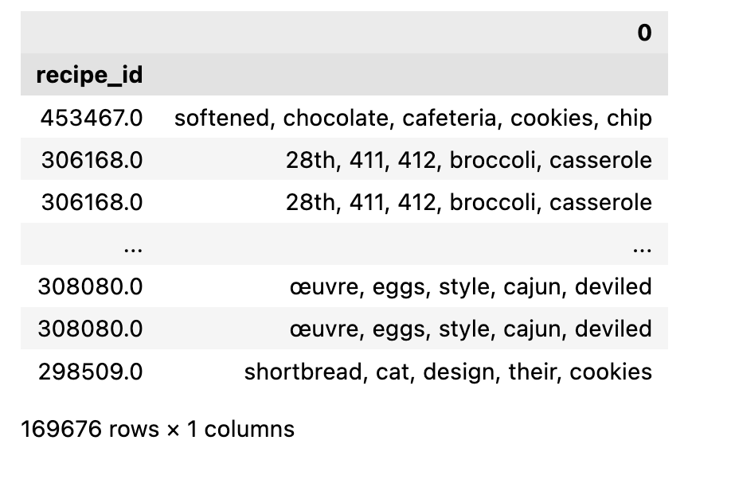

# Introduction
Author: Kaiwen Bian & Bella Wang

[Full Report Document](assets/report.pdf)

This project demonstrate how we may draw insights from a highly unbalanced data set using ensemble learning. Predictive model detecting user preference using **textual features** in combnation with other **numerical features** is the key first step prior to building a reconmander system or doing any other further analysis. The challenge that is addressed in this project is related to the highly imbalance nature of the `recipe` data set that we are using.

## Random Forest Algorithm
In this project, we will adapt ideas of **homogenous ensemble learning** where we will use multipl **Decision Trees**, and making them into a **Random Forest** for more  robust predictions of the data.

A **Decision Tree** essentially learns to come up with questions or decisions at an high dimensional space (depending on the number of features) and then separate the data using "boxes" or "lines" in that way. The core mechanism that allows it to happen is using *entropy minimization* where the model tries to reduce the entropy, or uncertainty of each split, making one catagory fit to one side and the other catagory to the other side.

$$
\text{entropy} &= - \sum_C p_C \log_2 p_C
$$

A **Random Forest** essentially is when at the splitting point of data to train/test/val, **a random subset of features** is taken out instead of choosing from all of them and then spliting the tree base on this subset of the feature, usually speaking $m = sqrt(d)$ seems to work well in practice and it is also the default that `sk_learn` uses. **This allows each decision trees to come up with different prediction rules for later on voting an best one**
- Notice that we are not doing simple boostrap of the data as each decision tree may not resemble too great of a difference in that way, instead, we are taking different features directly using the same type of model (decision tree), making it a homogenous ensemble learning method.
- We want the individual predictors to have low bias, high variance, and be uncorrelated with each other. In this way, when averaging (taking votes) them together, low bias and low variance would occur.

## Content for this Project
1. Introduction
2. Data Cleaning, Transformation, and EDA
    - Transformation
    - Univariate & Bivariate Analysis
    - Aggreagted Analysis
    - Textual Feature Analysis
3. Assessment of Missingness Mechanism
    - MAR Anlaysis
    - NMAR Analysis
4. Permutation Testing of TF-IDF
5. Framing a Predictive Question
6. Baseline Model: An Naive Approach
    - Handling Missingness in Data
    - Train/Val/Test Split
    - Feature Engineering
7. Final Model: Homogenous Ensemble Learning
    - Feature Engineering (Back to EDA)
    - Model Pipeline
    - Hyperparameter Tuning
    - Evaluation
        - Feature Importantness
        - Confusion Matrix, Evaluation Metrics, and ROC_AUC
8. Fairness Analysis

# Data Transformation and EDA
## Merging & Transformation
Initial merging is needed for the two dataset (`interaction` and `recipe`) to form one big data set. We performed a series of merging as follows:
1. Left merge the recipes and interactions datasets together.
2. In the merged dataset, we also filled all ratings of 0 with `np.NaN` as `rating` of zero doesn't make sense, we will be evaluating this in the `missingness mechanism` section.
3. We then find the average rating per recipe (as a series) and add this series containing the average rating per recipe back to the recipes dataset.

We also performed a series of follow up transformations to fit our needs for the data set as follows:
1. Some columns, like `nutrition`, contain values that look like lists, but are actually strings that look like lists. We turned the strings into actual columns for every unique value in those lists
2. Convert to list for `steps`, `ingredients`, and `tags`
3. Convert `date` and `submitted` to Timestamp object and rename as `review_date` and `recipe_date`
4. Convert Types
5. Drop same `id` (same with `recipe_id`)
6. Replace 'nan' with np.NaN

After the transformation, we have types of each of the columns as the following:
1. `String`: [name, contributor_id, user_id, recipe_id, ]
    - quantitative or qualitative, but cannot perform mathamatical operations (**quntitative discrete**)
    - `name` is the name of recipe
    - `contributor_id` is the author id of the recipe _(shape=7157)_
    - `recipe_id` is the id of teh recipe _(shape=25287)_
        - `id` from the original dataframe also is the id of the recipe, dropped after merging
    - `user_id` is the id of the reviewer _(shape=8402)_
2. `List`: [tags, steps, description, ingredients, review]
    - qualitative, no mathamatical operation (**qualitative discrete**)
3. `int`: [n_steps, minutes, n_ingredients, rating]
    - quantitative mathamatical operations allowed (**quantitative continuous**)
4. `float`: [avg_rating, calories, total_fat sugar, sodium, protein, sat_fat, carbs]
    - quantitative mathamatical operations allowed (**quantitative continuous**)
5. `Timestamp`: [recipe_date, review_date]
    - quantitative mathamatical operations allowed (**quantitative continuous**)

## Univariate & Bivariate Analysis
We will be performing **Explorative Data Analysis** for our data set:

Looks like that our data have a lot of outliers! we might want to write a function to deal with that. Here we are writing the function `outlier`, which will be used quite often later on.

Looks like the data are kind of **imbalanced** in `rating` (at this point, we thought that this wouldn't effect our modle too much, but it turns out later to be one of the main challenge that we need to deal with during the moeling phase).

Seems like there is a **threshold point** for `n_ingredients` and `n_steps`, this will be utilized later in our **feature engineering** section.

It also seems like more `sugar` and more `total_fat` (transformed from `nutrition`) seems to be related to higher `rating`! This is quite suprising!

Seems like there is some sort of relationships between `n_steps`, `n_ingredients`, and the `rating` column. However, this relationship doesn't seem to be that exact. In a later section we might use this idea.

## Aggreagted Analysis
Now we can first use the groupby function that we have implemented to look at some aggregated data first before using it for the next few sections

Looking at the right column of graph, it seems like the previous relationships taht we observed in no aggregation data is still preserved in the aggregated version where higher `calories` seems to be correlated to higher `rating` and `n_ingredients` and `n_steps` seems to have some relationships with `rating` as well.

When aggregating by user, something interesting appears, it seems like that `rating` column is not so much correlated with teh `n_steps` and `n_ingrredients` column though it is still quite correlated with the `calories` column. **Though we will not be working with this version of the aggregated data frame firectly when we are making our predictive model, this ideas may be taken into considerations when choosing features.**

## Textual Feature Analysis
We actually made more edas and feature engineering with **textual features**, but we will introduce those later in the section as it is much more relevant to our modeling process. For now, we will show some technique with TF-IDF that we will use later on in this project by checking the top 5 **most important** words in each of the rows (recipe_id) in the **original cleaned** data frame filtered by getting only the **5 rating recipes**(note, recipe_id is not unique here).
- We will probably not directly use this approach here as it runs really slow! But we may use a similar approach that have a better runtime complexity!

This would be an example output of such textual feature analysis:

# Assessment of Missingness Mechanism
We are specifically working with the version of the data set that have been grouped by with `recipe_id` to check the missingness, each `recipe_id` in this case would be unique. We can start with checking whcih column is missing. For the easiness of graphing, we will first slice out the outliers in each of the numerical columns using `outlier` function, which slices out ouliers that's out of the 99th percentile of the dataset

## NMAR Analysis
However, on the other hand, the `rating` column seems to be **Not Missing At Random (NMAR)** becuase from what the website is showing, some people just didn't give rating, so the rating itself doesn't exist during the data collection process, so it makes sense for it to be null. We manually added `np.NaN` into the data set where previously it was filled a zero in the data set. Since `avg_ratng` is calculated from using the `rating` column, `avg_rating` would then be **Missing At Random (MAR)** dependent on `rating`.

One interesting one to analyze is `description`, because it is hard to say directly how it may be correlated to any other columns in this data set, we suspect it to be **MAR**, but we will prove it to be **MAR** in the next section.

## MAR Anlaysis
### Decision Rule for `description`
Let's assume that the missingess of `description` column is related to the `col` column for **continuous** columns, wouldn't depend on **discrete** columns.

`description` seems to also depend on `n_ingredients`. This is a very interesting graph because looks like the graph **shape** is quite different with the **mean** the same, instead of using permutation test statistics that involves **mean** we use **K-S statistics** insteaad (we have also down a test using differences in mean as well, which fail to identify any results).

### Permutation Testing Using K-S Statistics
Now we want to perform permutation testing with each of the continuous variable within the data set (assuming that the missingness of `description` depends on them) and plot the distribution. Also, we decide to use a testing threshold of $p=0.05$

From what the plot have suggest, it seems like missingess for `description` is related to `n_ingredients` and it seems like missingness in `description` is not related to `calories` or `n_steps`.

# Permutation using TF-IDF
For this section, we will be working with the same data frame that was used in the missingness mechanism section, so a data frame that is grouped by `recipe_id`.

Since we want to do certain textual feature analysis for our predictive model, we were wondering whether `TF-IDF` of the `description` columns would actually play a role in deternmining the `rating` of an recipe. This can be deemed as a mini-warmup for our modeling procedure later on.

## Intro to TF-IDF
### Term Frequency Inverse Document Frequency
`TF-IDF` is a very naive but common and well performing technique that people use to understand textual features. It essentially meausres the **how important** an word $t$ is for an sentence in comparison with all sentences in the document. The `TF-IDF` Formula is a as follows:

$$
\text{tfidf}(t, d) &= \text{tf}(t, d) \cdot \text{idf}(t) \\\ &= \frac{\text{\# of occurrences of $t$ in $d$}}{\text{total \# of words in $d$}} \cdot \log \left(\frac{\text{total \# of documents}}{\text{\# of documents in which $t$ appears}} \right)
$$

We will be using `TfidfVectorizer` to help our calculation.

### Differences in Max for TF-IDF
We want to see whether the distibution of `high_rated` recipes and the distribution of `low_rated` recipes actually come from the same distribution. Thus, we will be performing a **permutation test** here with the following hypothesis:
- **Null hypothesis**: There **are no** differences in the distribution for the `high_rated` recipes and low_rated` recipes.
- **Alternative hypothesis**: There **are** differences in the distribution for the `high_rated` recipes and low_rated` recipes.

We decide to use a testing threshold of $p=0.05$

As for the **test statistics**, we actually have many options, but they all circles around the **differences** of something:
- Using `sum` -> longer sentences have greater sum
- Using `mean` -> very easy to be influenced by outlier
- Using `partial-mean` -> get the most essence part of the sentence, however, complexity too high because of the sorting
- Using `max` -> most important one word's TF-IDF

With all these considerations, we pick our test statistics to be **differences in max of TF-IDF for each sentence**

This section provide a **solid prove** of why we are using TF-IDF as a feature for our predictive model!

## Conducting Permutation Testing

The result is significant! **We reject the null hypothesis! There is a difference in the distribution for `high_rated` recipes and `low_rated` recipes.**

# Framing a Predictive Question
From the previous section we have learned that Recipe's `Max TF-IDF` distribution is different for `high_rated` recipe than `low_rated` recipe, so now we want to go a step further: we want to predict `rating` as a classfication problem to demonsrate user preference and as a potential prior to **reconmander system**

Specifically, **we want to predict `rating` (5 catagories) in the original data frame to demonstarte understanding of user preference.** In this section we will be using the original big DataFrame for predicting `rating`.

# Baseline Model: An Naive Approach

Notice that in here we did create a extra feature of `is_low` and `is_good`, which will be use for later. We have conider the problem of ptential **data leakage**. However, this is prior to train/val/test split and the test data (not being used for fit) would not have such problem.

## Handling Missing Data
1. It have been shwon earlier that the missingness of the `rating` columns seems to be **NMAR**, so it is not dependent on the column but rather depending on itself. Thus, the naive approach taht we will be imputing the ratings through **random imputation**. However, because of the high imbalance nature of the data set, this may cause more `rating` of 5 to come up.
    - Regarding this issue, we ran the model on both imupting randomly and also on dropping the missing data directly for the `rating` column (second choise make sure that the target column is not randomly imputed, this may cause error)
    - After experimentation, drpping the missing `rating` directly results in both a training/validation and testing accuracy
2. For the missingness in `description`, we make sure that the distribution of the data is the same by not dropping it but rather imputing it with simple white space. It is true that the    `description` column missgness is MAR, but it would be quite difficult to try to impute it, so we pick an naive solution in this project
3. For missingness in `name`, because it is MCAR, we drop it directly.

## Train/Validate/Test Split
We are splitting the main data set into 3 components of `train`, `validate`, and `test`. The main data set is plit to `big_train` and `test` first with big_train being 75% of the data. Then, the big_train data set is split again into the `validate` and the actual `train` data set with 75% in the train data set again. Each set is taking the percentatge as calculated below:
- Test: 25%
- Train_big: 75%
- Validate: 18.75%
- Train: 56.25%

## Feature Engineering
In the basic model pipeline we are working with not a great number of features:
1. binarized `n_step` with threshold 25
2. binarized `n_ingredients` with threshold 20
3. normalized `minutes` with respects to binarized `n_steps` using the customized class `StdScalerByGroup`
4. normalized `minutes` with respects to binarized `n_ingredients` using the customized class as above
5. simple counts of `tags` column

## Baseline Model's Pipeline
The pipeline for the model is constituted with a simple **Random Forest** multi-class classfier with hyperparameter tuned

Turns out the original dataset is highly **imbalanced**, making the model always predicting a `rating` of 5 not missing many of the other details. This also means that as long as the model is always predicting the `rating` of 5, it will get an accuracy of 77% because 77% of the `rating` is 5 -> **accuracy doesn't entell everything!**. Thus, we need a better model than this that can capture some what more feature information, more engineering is needed!

# Final Model: Ensemble Learning
Now with the previous baseline model's problem in mind, let's make some actual useful feature engineering, mainly we will be utilizing these features:

## Feature Engineering (Back to EDA)
The previous features are carried over to this model, which includes:
1. binarized `n_step` with threshold 25, this is a result from eda
2. binarized `n_ingredients` with threshold 20, this is a result from eda
3. normalized `minutes` with respects to binarized `n_steps`
4. normalized `minutes` with respects to binarized `n_ingredients`
5. simple counts of `tags` column, showing how many tags are in each `tag` column

In addition, awe also added afew more features to capture the relationship we saw from EDA, whcih includes:
1. Some numerical columns of `sugar`,`sodium`,`calories`,`total_fat` that have being standerlized using `RobustScaler`
2. Two `TF-IDF` that have been `one hot encoded`:
    - In particular, the naive approach is to use the highest TF-IDF for each of the words are extracted for each of the sentence using `argmax`, representing the most important words in a sentence (we are using `argmax` here is for considering the complexity of this model, later implementations can utilzie more words that have high TF-IDF)
    - We then construct a pool of highest TF-IDF words in the **low** `rating` dataset, which was originally defined as `rating` lower than or equal to 3 and it is stored as a boolean indicator in the `is_low` column.
    - Finally, we want to see whether or not the current sentence's highest TF-IDF word is in such pool of words
    - We perform such operations with both the `name` column and also the `description` column
    - **Remark**: this feature improved the final model by roughly 10% accuracy, this is the `detect_key_low(df)` function
        - We ahve also tried to trade off some complexity with better accuracy by using the count of the 5 top TF-IDF words in each row (just this function runs for about 3m)
        - However, the performance didn't perform as well as `argmax`, whihch may be due to extra noise added (48% accuracy with 5 words and 50% accuracy with one word)
3. The `recipe_dtae` column have also being taken out with only the year of the recipe and then `one hot encoded` as well.
4. At last, we also used the `tag` column of each of the sentence to perform `one hot encoding`
    - We first performed `one hot encoding` to transform each tag to a numerical boolean representation. However, this makes the feature space to reahc to about 500 features, which adds too much **sparsity** to the feature space and may introduces **noises**
    - Thus we `filtered` out all the **irrelevant** or **low counted** tags (<1000 counts) and reduces teh feature spac  to only adding 80 more features
    - At last, we conducted `pca` to reduce the adding feature space to just abou 10 features and this value seems to work well with the data set experimentally.
    - The `tag_ohe_pca(df)` function takes care of this step
5. Analyzing whether the `review` columns contain certain sentiment words in it, evaluated by the `is_sentiment(df)` function
6. We have taken out irrelevant features such as the `naive_bayes` encoder taht we have implemented

## Model Pipeline
Since this is a **multi-class classifictaion** problem and the data is also highly **imbalanced**, we are also adding a **dummy** classifier that classifies uniformally at random to bench mark our modle's performances. Of course, we will also use different evaluation metrics later to demonstarte the model's performances as well, the dummy classfier is just an "easy to view" example.

For the pipeline, we are still doing an **Homogenous Ensemble Learning** with decision tree as it have being shown to perform the best experimentally (we have tried hetergenous ensemble learning using voting/stacking with models such as SVM and logistic regression, but none of the perform as well as the simple random forest).

We balanced the dataset by using automatic balaning argumnet `"balanced"`, we have also tried to use self customized dictionaries for assigning weights, However, this wouldn't be generalizable to unseen data as the distribution of data changes. The `sk_learn` packages does automatic weight assigning by the following formula:

$$
n_samples / (n_classes * np.bincount(y))
$$

This model pipeline takes about 50 seconds to fit

## Hyperparameter Tuning

# Model Evaluation
We will be conducting some simple evaluation with the model in this section with confusion matrix just to see the basic performance of the model. A more detaile  performance evaluation would be conducted in the **Test Data Evaluation** section. To really understand what we are evaluating, we need to first understand what metrics matters to us:

Example:
- **Precision for 5**: Out of all 5 we predicted, how many are actually 5 
- **Recall for 5**: Out of all actual 5, how many did we get right

We care about getting a correct rating for reconmandation, we care about finding **Recall** but still considering precision, accuracy, F1 scores.

### Feature Importantness
We have 60 features in our model with feature 0 and feature 1 having the most effect! these are the 2 argmax `TF-IDF` encoder that we have implemented, this is consistent with ou previous **permutation testing** that shows the `TF-IDF` distribution for `high_rated` and `low_rated` recipes are different distributions.

Other than that, the second highest feature importantness is teh forth feature to the 11th feature and 22th feature to 31th feature. These correspond to the `tag_pca` column!

### Confusion Matrix, Evaluation Metrics, and ROC_AUC
Let's formalize the test result by using the `classification_report` function from `sk_learn`
- The bottom of the table shows 2 different aspects of the prediction evaluation,
    1. one is `macro_avg` or the simple average for each of teh column of evaluation metrics
    2. one is `weighted_avg`, which re-evaluate the accuracy of our modle based on the data distribution of the data set, whcih provide a better representation of the model's performance given imbalanced data like this one.

After the `weighted_avg` evaluation, it looks like our model achieves a pretty good performance, 3 of them (precision, recall, and f1 score) all being **70%**! This is quite good considering we are doing a multi class classification, for comparison, we can intoduce the uniformaly dummy clasfier to make a baseline comparison.

Clearly, there is a difference in the recall and f1 score. There isn't that big of a differences in precision for the weighted avg because the number of 5 rating are plenty in the data set (77%), causing the precision for 5 to reach 77% directly.

Next, we want to also look at the `ROC_AUC` score or **area under the receiver operating characteristic curve**. Again, like many metrics, they are originally designed for binary classfications, but we can also apply to multi-class classfications by doing `ovr` strategy (estimating by making grouped for comparison).

This is pretty good! from [here](https://en.wikipedia.org/wiki/Receiver_operating_characteristic) we can show the curve of ROC for different performance of an classfier. Our model's performance shows that about about 70% of teh area are covered, signifying that our model performs quite well!

# Fairness Analysis
We want to evaluate whether the model is fair for treating all populations. In particular, we want to check in the scope of looking at the predictions for the `vegan` group and the `vegetarian` group. Let's first check how many of them are in the data set.

## Difference Significant?
We run a **permutation test** to see if the difference in accuracy is significant.
- **Null Hypothesis**: The classifier's accuracy is the same for both `vegan` + `vegetarian` tags and non `vegan` + `vegetarian` tags, and any differences are due to chance.
- **Alternative Hypothesis**: The classifier's accuracy is higher for non `vegan` + `vegetarian` tags.
- Test statistic: Difference in accuracy (is_in minus not_in).
- Significance level: 0.05

This result is **significant**, we reject the null hypothesis!

## More Questions?
<a href="https://github.com/KevinBian107/ensemble_imbalance_data" style="background-color: #007bff; color: white; padding: 10px 15px; text-decoration: none; border-radius: 5px; font-size: 16px;">Visit Developer Repository</a>